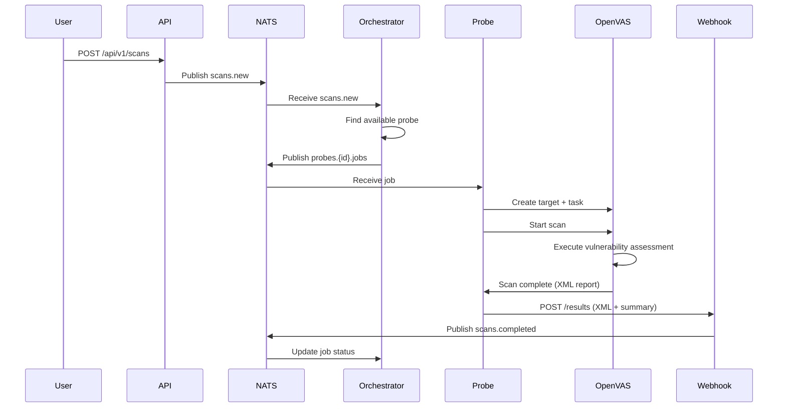

# Greenbone Distributed Scanning Platform - Architecture

## Overview

Esta plataforma distribui vulnerability assessments usando OpenVAS/Greenbone através de probes geograficamente dispersos, com orquestração centralizada.

## Design Principles

1. **Probes efêmeros** - Sem persistência de dados local, sem IP fixo
2. **Zero customização GVM** - Usar imagens oficiais/comunitárias
3. **Comunicação iniciada pelo probe** - Probe conecta no central
4. **Sistemas externos sempre que possível** - Priorizar soluções terceirizadas
5. **Single-tenant** - Uso interno único

## Component Diagram

```
┌─────────────────────────────────────────────────────────────────────────┐
│                              VPS CENTRAL                                 │
│                                                                          │
│  ┌────────────────────────────────────────────────────────────────────┐ │
│  │                           NATS Server                               │ │
│  │   scans.new → scans.pending → probes.{id}.jobs                     │ │
│  │                              ← scans.completed ← scans.results      │ │
│  └────────────────────────────────────────────────────────────────────┘ │
│         ▲                         ▲                         ▲           │
│         │                         │                         │           │
│  ┌──────┴──────┐           ┌──────┴──────┐           ┌──────┴──────┐   │
│  │     API     │           │ Orchestrator │           │   Webhook   │   │
│  │   (Go/Chi)  │           │     (Go)     │           │    (Go)     │   │
│  │   :8080     │           │              │           │   :8081     │   │
│  └─────────────┘           └──────────────┘           └──────┬──────┘   │
│         │                                                     │         │
│         │                  ┌──────────────┐                   │         │
│         │                  │  VoidProbe   │◀──────────────────│─────────│
│         │                  │   Server     │    gRPC tunnel    │         │
│         │                  │   :9000      │                   │         │
│         │                  └──────┬───────┘                   │         │
│         │                         │                           │         │
└─────────┼─────────────────────────┼───────────────────────────┼─────────┘
          │                         │                           │
    REST API                   Tunnel                      HTTP POST
          │                         │                           │
          ▼                         ▼                           │
    ┌─────────┐              ┌─────────────┐                    │
    │ Cliente │              │   PROBE N   │────────────────────┘
    │ Externo │              │             │
    └─────────┘              │ ┌─────────┐ │
                             │ │VoidProbe│ │
                             │ │ Client  │ │
                             │ └────┬────┘ │
                             │      │      │
                             │ ┌────▼────┐ │
                             │ │Satellite│ │
                             │ │Controller│ │
                             │ │ (Python)│ │
                             │ └────┬────┘ │
                             │      │      │
                             │ ┌────▼────┐ │
                             │ │ OpenVAS │ │
                             │ │(immauss)│ │
                             │ └─────────┘ │
                             └─────────────┘
```

## Data Flow

### Scan Submission Flow



## NATS Subjects

| Subject | Publisher | Subscriber | Purpose |
|---------|-----------|------------|---------|
| `scans.new` | API | Orchestrator | New scan requests |
| `scans.pending` | Orchestrator | - | Jobs waiting for probe |
| `scans.assigned` | Orchestrator | - | Jobs assigned to probes |
| `scans.completed` | Webhook | Orchestrator | Completed scans |
| `scans.results` | Webhook | External | Full scan results |
| `probes.register` | Satellite | Orchestrator | Probe registration (request/reply) |
| `probes.status` | Satellite | Orchestrator | Heartbeat |
| `probes.{id}.jobs` | Orchestrator | Satellite | Jobs for specific probe |

## Security Model

### Probe → Central Communication

| Layer | Method |
|-------|--------|
| Transport | VoidProbe gRPC tunnel (TLS) |
| NATS | Token authentication per probe |
| Webhook | Bearer token in Authorization header |

### User → API

| Layer | Method |
|-------|--------|
| Transport | HTTPS |
| Authentication | Bearer token (API_TOKEN) |

## Resource Requirements

### Central (VPS)

| Resource | Minimum | Recommended |
|----------|---------|-------------|
| vCPU | 2 | 4 |
| RAM | 4 GB | 8 GB |
| Storage | 20 GB SSD | 50 GB SSD |
| Network | 100 Mbps | 1 Gbps |

### Probe

| Resource | Minimum | Recommended |
|----------|---------|-------------|
| vCPU | 2 | 4 |
| RAM | 4 GB | 8 GB |
| Storage | 10 GB SSD | 20 GB SSD |
| Network | 10 Mbps | 100 Mbps |

> **Note:** OpenVAS is resource-intensive. RAM is the primary constraint.

## Scaling Considerations

### Current Limits
- Maximum 4 probes (initial phase)
- Single orchestrator (no HA)
- In-memory job tracking (loses state on restart)

### Future Improvements
- Redis/PostgreSQL for persistent job storage
- Multiple orchestrator instances with leader election
- Geographic probe selection based on target location
- Rate limiting per probe
